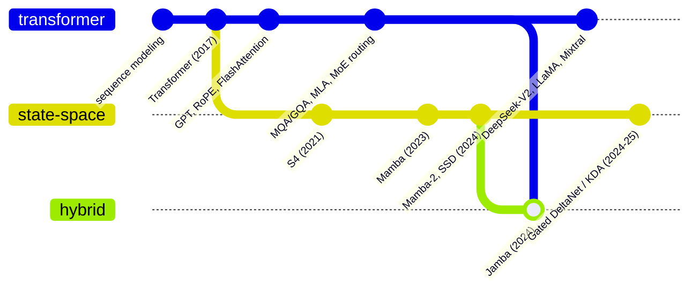

# The Map

A structured taxonomy of the ideas that took the 2017 Transformer to the models
frontier labs ship today. Each row is a folder at the repo root with a
`README.md` (intuition, math, references) and a minimal, runnable PyTorch
`implementation.py`.

Scope note: this map tracks the **decoder-only LLM lineage across every
mainstream sequence-mixing mechanism** — attention (Transformer),
state-space/recurrent (Mamba), and the hybrids that combine them — and
the architectural/inference techniques that make each fast at scale. It
deliberately excludes encoder-only models (BERT), encoder-decoder models
(T5), pure vision transformers, and training/alignment techniques (RLHF,
DPO) that aren't architecture per se — see [README.md](README.md) for the
full scope rationale.

## Visual map

**Which family a technique belongs to, and where the branches meet** —
architecture families as branches off a common root, hybrids as merge
commits. The tables below have the complete list within each branch; the
[interactive map](https://ioannisantoniadis.github.io/transformer-atlas/visual-map.html)
has the same git-graph plus two more views this file doesn't repeat —
a forward-pass **Pipeline** breakdown and a chronological **Timeline** —
both with click-through to every folder and paper:

## 1. Foundations: Transformer

| Topic | Lab | Year | Paper |
|---|---|---|---|
| [`transformer`](transformer/) | Google Brain | 2017 | [Attention Is All You Need](https://arxiv.org/abs/1706.03762) |
| [`gpt`](gpt/) (GPT-2 / GPT-3) | OpenAI | 2019 / 2020 | [GPT-2](https://cdn.openai.com/better-language-models/language_models_are_unsupervised_multitask_learners.pdf), [GPT-3](https://arxiv.org/abs/2005.14165) |

## 2. Foundations: State-Space Models

| Topic | Lab | Year | Paper |
|---|---|---|---|
| [`s4-and-structured-state-spaces`](s4-and-structured-state-spaces/) (S4) | Stanford | 2021 | [Efficiently Modeling Long Sequences with Structured State Spaces](https://arxiv.org/abs/2111.00396) |
| [`mamba-and-mamba-2`](mamba-and-mamba-2/) | CMU / Princeton | 2023 / 2024 | [Mamba](https://arxiv.org/abs/2312.00752), [Mamba-2 (SSD)](https://arxiv.org/abs/2405.21060) |

## 3. Positional Encoding

| Topic | Lab | Year | Paper |
|---|---|---|---|
| [`rotary-position-embedding`](rotary-position-embedding/) (RoPE) | Zhuiyi / EleutherAI-adopted | 2021 | [RoFormer](https://arxiv.org/abs/2104.09864) |
| [`alibi`](alibi/) | UW / FAIR | 2021 | [Train Short, Test Long](https://arxiv.org/abs/2108.12409) |
| [`yarn-and-rope-scaling`](yarn-and-rope-scaling/) | Meta / Nous Research et al. | 2023 | [Position Interpolation](https://arxiv.org/abs/2306.15595), [YaRN](https://arxiv.org/abs/2309.00071) |

## 4. Normalization & Feedforward Blocks

| Topic | Lab | Year | Paper |
|---|---|---|---|
| [`rmsnorm-and-swiglu`](rmsnorm-and-swiglu/) | - / Google | 2019 / 2020 | [RMSNorm](https://arxiv.org/abs/1910.07467), [GLU Variants](https://arxiv.org/abs/2002.05202) |
| [`manifold-constrained-hyper-connections`](manifold-constrained-hyper-connections/) (mHC) | DeepSeek AI | 2025 | [mHC](https://arxiv.org/abs/2512.24880) |
| [`attention-residuals`](attention-residuals/) (AttnRes) | Moonshot AI / Kimi | 2026 | [Attention Residuals](https://arxiv.org/abs/2603.15031) |

## 5. Sequence Mixing: Attention Family

Attention was never the only sequence-mixing mechanism in scope, just the
first one mapped — see [section 2](#2-foundations-state-space-models) for
the state-space branch, whose entries are variants on the *same* problem
(mix information across the sequence) solved a structurally different way.

| Topic | Lab | Year | Paper |
|---|---|---|---|
| [`multi-query-and-grouped-query-attention`](multi-query-and-grouped-query-attention/) (MQA/GQA) | Google | 2019 / 2023 | [MQA](https://arxiv.org/abs/1911.02150), [GQA](https://arxiv.org/abs/2305.13245) |
| [`flash-attention`](flash-attention/) | Stanford (Dao et al.) | 2022 | [FlashAttention](https://arxiv.org/abs/2205.14135) |
| [`sliding-window-attention`](sliding-window-attention/) | Mistral AI | 2023 | [Mistral 7B](https://arxiv.org/abs/2310.06825) |
| [`linear-attention`](linear-attention/) | Idiap / Google | 2020 | [Linear Transformers](https://arxiv.org/abs/2006.16236), [Performer](https://arxiv.org/abs/2009.14794) |
| [`multi-head-latent-attention`](multi-head-latent-attention/) (MLA) | DeepSeek AI | 2024 | [DeepSeek-V2](https://arxiv.org/abs/2405.04434) |
| [`star-attention`](star-attention/) | NVIDIA | 2024 | [Star Attention](https://arxiv.org/abs/2411.17116) |
| [`ring-attention`](ring-attention/) | UC Berkeley | 2023 | [Ring Attention](https://arxiv.org/abs/2310.01889) |
| [`longformer-and-sparse-attention`](longformer-and-sparse-attention/) | AI2 / OpenAI | 2020 / 2019 | [Longformer](https://arxiv.org/abs/2004.05150), [Sparse Transformer](https://arxiv.org/abs/1904.10509) |
| [`compressed-sparse-attention`](compressed-sparse-attention/) (CSA/HCA) | DeepSeek AI | 2026 | [DeepSeek-V4](https://arxiv.org/abs/2606.19348) |
| [`gated-deltanet-and-kda`](gated-deltanet-and-kda/) (DeltaNet → Gated DeltaNet → KDA) | MIT / NVIDIA / Moonshot AI | 2024–25 | [DeltaNet](https://arxiv.org/abs/2406.06484), [Gated DeltaNet](https://arxiv.org/abs/2412.06464), [KDA](https://arxiv.org/abs/2510.26692) |

## 6. Mixture of Experts

Cross-cutting — MoE routing applies to the feedforward block regardless
of which sequence-mixing mechanism the layer uses; see [`jamba-and-hybrid-architectures`](jamba-and-hybrid-architectures/)
for a shipped model applying it across both.

| Topic | Lab | Year | Paper |
|---|---|---|---|
| [`mixture-of-experts`](mixture-of-experts/) (sparse gating → Switch → DeepSeekMoE) | Google / DeepSeek | 2017 / 2021 / 2024 | [Shazeer et al.](https://arxiv.org/abs/1701.06538), [Switch Transformer](https://arxiv.org/abs/2101.03961), [DeepSeekMoE](https://arxiv.org/abs/2401.06066) |

## 7. Full Model Architectures: Transformer (composed systems)

| Topic | Lab | Year | Paper |
|---|---|---|---|
| [`llama`](llama/) | Meta | 2023 | [LLaMA](https://arxiv.org/abs/2302.13971), [LLaMA 2](https://arxiv.org/abs/2307.09288) |
| [`mixtral`](mixtral/) | Mistral AI | 2024 | [Mixtral of Experts](https://arxiv.org/abs/2401.04088) |
| [`deepseek-v2`](deepseek-v2/) | DeepSeek AI | 2024 | [DeepSeek-V2](https://arxiv.org/abs/2405.04434) |
| [`qwen`](qwen/) | Alibaba | 2023–24 | [Qwen Technical Report](https://arxiv.org/abs/2309.16609) |
| [`gemma`](gemma/) | Google DeepMind | 2024 | [Gemma](https://arxiv.org/abs/2403.08295), [Gemma 2](https://arxiv.org/abs/2408.00118) |

## 8. Hybrid Architectures

The merge commits — models that interleave the Transformer and
State-Space branches within one architecture, rather than choosing one.

| Topic | Lab | Year | Paper |
|---|---|---|---|
| [`jamba-and-hybrid-architectures`](jamba-and-hybrid-architectures/) | AI21 Labs | 2024 | [Jamba](https://arxiv.org/abs/2403.19887), [Jamba-1.5](https://arxiv.org/abs/2408.12570) |

## 9. Inference-Time Serving

Cross-cutting — KV caching, quantization, and speculative decoding apply
to a shipped model regardless of whether its backbone is attention,
state-space, or hybrid.

| Topic | Lab | Year | Paper |
|---|---|---|---|
| [`kv-caching-and-paged-attention`](kv-caching-and-paged-attention/) | - / UC Berkeley (vLLM) | - / 2023 | [PagedAttention / vLLM](https://arxiv.org/abs/2309.06180) |
| [`speculative-decoding`](speculative-decoding/) | Google / DeepMind | 2023 | [Leviathan et al.](https://arxiv.org/abs/2211.17192), [Chen et al.](https://arxiv.org/abs/2302.01318) |
| [`quantization-for-inference`](quantization-for-inference/) (GPTQ/AWQ/INT4) | IST Austria / MIT | 2022–23 | [GPTQ](https://arxiv.org/abs/2210.17323), [AWQ](https://arxiv.org/abs/2306.00978) |

---

## How to read this map

- **Rows are additive.** Read top to bottom: `transformer` is the baseline
  every other row modifies one piece of. `llama`, `mixtral`, and
  `deepseek-v2` are *compositions* — they don't introduce new primitives so
  much as pick a specific combination of the rows above (RoPE + RMSNorm +
  SwiGLU + GQA, for `llama`; that plus MoE routing, for `mixtral`; MLA +
  fine-grained MoE, for `deepseek-v2`).
- **Branches solve the same problem differently, not different problems.**
  Sections 1-2 are two answers to "how do you mix information across a
  sequence" (attention's any-to-any weighted lookup vs. a state-space
  recurrence's fixed-size compressed summary) — everything downstream in
  each branch is a refinement of its answer, and section 8 is what
  happens when a model uses both answers in the same forward pass. Each
  topic's `README.md` states its `Family` explicitly.
