# The Map

A structured taxonomy of the ideas that took the 2017 Transformer to the models
frontier labs ship today. Each row is (eventually) a folder at the repo root
with a `README.md` (intuition, math, references) and a minimal, runnable
PyTorch `implementation.py`.

Status: ✅ written · 🔲 planned (in the map, not yet built — PRs/contributions welcome)

Scope note: this map tracks the **decoder-only LLM lineage and the
architectural/inference techniques that make it fast at scale**. It
deliberately excludes encoder-only models (BERT), encoder-decoder models
(T5), pure vision transformers, and training/alignment techniques (RLHF,
DPO) that aren't architecture per se — see [README.md](README.md) for the
full scope rationale.

## Visual map

The tables below are the source of truth; these two diagrams are the same
26 topics read two other ways. There's also an
[interactive version](https://johnantonn.github.io/transformer-atlas/visual-map.html)
of both, with click-through to each folder and paper.

**Where each technique sits in a forward pass** — every row below modifies
one stage of the same decoder-only block, in the order data actually flows
through it:

```mermaid
flowchart TD
    classDef foundations fill:#3b5166,color:#fff,stroke:#25384a
    classDef positional fill:#3f7d6e,color:#fff,stroke:#2b5a4f
    classDef normffn fill:#7a5f96,color:#fff,stroke:#5a4570
    classDef attention fill:#c05f24,color:#fff,stroke:#8f4419
    classDef moe fill:#a6433f,color:#fff,stroke:#7a302d
    classDef composed fill:#4f7a3f,color:#fff,stroke:#385a2d
    classDef serving fill:#a67c1e,color:#fff,stroke:#7a5c15

    subgraph S1["1 . Token input and baseline block"]
        transformer["transformer<br/>Google Brain, 2017"]
        gpt["gpt GPT-2/3<br/>OpenAI, 2019-20"]
    end

    subgraph S2["2 . Positional encoding"]
        rope["RoPE<br/>2021"]
        alibi["ALiBi<br/>2021"]
        yarn["YaRN / RoPE scaling<br/>2023"]
    end

    subgraph S3["3 . Normalization and feedforward"]
        rmsnorm["RMSNorm + SwiGLU<br/>2019-20"]
        mhc["mHC<br/>2025"]
        attnres["Attention Residuals<br/>2026"]
    end

    subgraph S4["4 . Attention mechanism"]
        mqagqa["MQA / GQA<br/>2019-23"]
        flash["FlashAttention<br/>2022"]
        swa["Sliding-Window Attention<br/>2023"]
        linattn["Linear Attention<br/>2020"]
        mla["Multi-Head Latent Attention<br/>2024"]
        star["Star Attention<br/>2024"]
        ring["Ring Attention<br/>2023"]
        longformer["Longformer / Sparse<br/>2019-20"]
        csahca["CSA / HCA<br/>2026"]
    end

    subgraph S5["5 . Feedforward to sparse routing"]
        moe["Mixture of Experts<br/>2017-24"]
    end

    subgraph S6["6 . Full model architectures"]
        llama["LLaMA<br/>2023"]
        mixtral["Mixtral<br/>2024"]
        deepseekv2["DeepSeek-V2<br/>2024"]
        qwen["Qwen<br/>2023-24"]
        gemma["Gemma<br/>2024"]
    end

    subgraph S7["7 . Inference-time serving"]
        kvcache["KV Caching + PagedAttention<br/>2023"]
        specdec["Speculative Decoding<br/>2023"]
        quant["Quantization GPTQ/AWQ<br/>2022-23"]
    end

    S1 --> S2 --> S3 --> S4 --> S5 --> S6 --> S7

    class transformer,gpt foundations
    class rope,alibi,yarn positional
    class rmsnorm,mhc,attnres normffn
    class mqagqa,flash,swa,linattn,mla,star,ring,longformer,csahca attention
    class moe moe
    class llama,mixtral,deepseekv2,qwen,gemma composed
    class kvcache,specdec,quant serving
```

**Who shipped what, when** — the same techniques ordered by publication
year instead of by pipeline stage:

## 1. Foundations

| Topic | Lab | Year | Paper | Status |
|---|---|---|---|---|
| [`transformer`](transformer/) | Google Brain | 2017 | [Attention Is All You Need](https://arxiv.org/abs/1706.03762) | ✅ |
| [`gpt`](gpt/) (GPT-2 / GPT-3) | OpenAI | 2019 / 2020 | [GPT-2](https://cdn.openai.com/better-language-models/language_models_are_unsupervised_multitask_learners.pdf), [GPT-3](https://arxiv.org/abs/2005.14165) | ✅ |

## 2. Positional Encoding

| Topic | Lab | Year | Paper | Status |
|---|---|---|---|---|
| [`rotary-position-embedding`](rotary-position-embedding/) (RoPE) | Zhuiyi / EleutherAI-adopted | 2021 | [RoFormer](https://arxiv.org/abs/2104.09864) | ✅ |
| [`alibi`](alibi/) | UW / FAIR | 2021 | [Train Short, Test Long](https://arxiv.org/abs/2108.12409) | ✅ |
| [`yarn-and-rope-scaling`](yarn-and-rope-scaling/) | Meta / Nous Research et al. | 2023 | [Position Interpolation](https://arxiv.org/abs/2306.15595), [YaRN](https://arxiv.org/abs/2309.00071) | ✅ |

## 3. Normalization & Feedforward Blocks

| Topic | Lab | Year | Paper | Status |
|---|---|---|---|---|
| [`rmsnorm-and-swiglu`](rmsnorm-and-swiglu/) | - / Google | 2019 / 2020 | [RMSNorm](https://arxiv.org/abs/1910.07467), [GLU Variants](https://arxiv.org/abs/2002.05202) | ✅ |
| [`manifold-constrained-hyper-connections`](manifold-constrained-hyper-connections/) (mHC) | DeepSeek AI | 2025 | [mHC](https://arxiv.org/abs/2512.24880) | ✅ |
| [`attention-residuals`](attention-residuals/) (AttnRes) | Moonshot AI / Kimi | 2026 | [Attention Residuals](https://arxiv.org/abs/2603.15031) | ✅ |

## 4. Attention Mechanisms & Efficiency Variants

| Topic | Lab | Year | Paper | Status |
|---|---|---|---|---|
| [`multi-query-and-grouped-query-attention`](multi-query-and-grouped-query-attention/) (MQA/GQA) | Google | 2019 / 2023 | [MQA](https://arxiv.org/abs/1911.02150), [GQA](https://arxiv.org/abs/2305.13245) | ✅ |
| [`flash-attention`](flash-attention/) | Stanford (Dao et al.) | 2022 | [FlashAttention](https://arxiv.org/abs/2205.14135) | ✅ |
| [`sliding-window-attention`](sliding-window-attention/) | Mistral AI | 2023 | [Mistral 7B](https://arxiv.org/abs/2310.06825) | ✅ |
| [`linear-attention`](linear-attention/) | Idiap / Google | 2020 | [Linear Transformers](https://arxiv.org/abs/2006.16236), [Performer](https://arxiv.org/abs/2009.14794) | ✅ |
| [`multi-head-latent-attention`](multi-head-latent-attention/) (MLA) | DeepSeek AI | 2024 | [DeepSeek-V2](https://arxiv.org/abs/2405.04434) | ✅ |
| [`star-attention`](star-attention/) | NVIDIA | 2024 | [Star Attention](https://arxiv.org/abs/2411.17116) | ✅ |
| [`ring-attention`](ring-attention/) | UC Berkeley | 2023 | [Ring Attention](https://arxiv.org/abs/2310.01889) | ✅ |
| [`longformer-and-sparse-attention`](longformer-and-sparse-attention/) | AI2 / OpenAI | 2020 / 2019 | [Longformer](https://arxiv.org/abs/2004.05150), [Sparse Transformer](https://arxiv.org/abs/1904.10509) | ✅ |
| [`compressed-sparse-attention`](compressed-sparse-attention/) (CSA/HCA) | DeepSeek AI | 2026 | [DeepSeek-V4](https://arxiv.org/abs/2606.19348) | ✅ |

## 5. Mixture of Experts

| Topic | Lab | Year | Paper | Status |
|---|---|---|---|---|
| [`mixture-of-experts`](mixture-of-experts/) (sparse gating → Switch → DeepSeekMoE) | Google / DeepSeek | 2017 / 2021 / 2024 | [Shazeer et al.](https://arxiv.org/abs/1701.06538), [Switch Transformer](https://arxiv.org/abs/2101.03961), [DeepSeekMoE](https://arxiv.org/abs/2401.06066) | ✅ |

## 6. Full Model Architectures (composed systems)

| Topic | Lab | Year | Paper | Status |
|---|---|---|---|---|
| [`llama`](llama/) | Meta | 2023 | [LLaMA](https://arxiv.org/abs/2302.13971), [LLaMA 2](https://arxiv.org/abs/2307.09288) | ✅ |
| [`mixtral`](mixtral/) | Mistral AI | 2024 | [Mixtral of Experts](https://arxiv.org/abs/2401.04088) | ✅ |
| [`deepseek-v2`](deepseek-v2/) | DeepSeek AI | 2024 | [DeepSeek-V2](https://arxiv.org/abs/2405.04434) | ✅ |
| [`qwen`](qwen/) | Alibaba | 2023–24 | [Qwen Technical Report](https://arxiv.org/abs/2309.16609) | ✅ |
| [`gemma`](gemma/) | Google DeepMind | 2024 | [Gemma](https://arxiv.org/abs/2403.08295), [Gemma 2](https://arxiv.org/abs/2408.00118) | ✅ |

## 7. Inference-Time Serving

| Topic | Lab | Year | Paper | Status |
|---|---|---|---|---|
| [`kv-caching-and-paged-attention`](kv-caching-and-paged-attention/) | - / UC Berkeley (vLLM) | - / 2023 | [PagedAttention / vLLM](https://arxiv.org/abs/2309.06180) | ✅ |
| [`speculative-decoding`](speculative-decoding/) | Google / DeepMind | 2023 | [Leviathan et al.](https://arxiv.org/abs/2211.17192), [Chen et al.](https://arxiv.org/abs/2302.01318) | ✅ |
| [`quantization-for-inference`](quantization-for-inference/) (GPTQ/AWQ/INT4) | IST Austria / MIT | 2022–23 | [GPTQ](https://arxiv.org/abs/2210.17323), [AWQ](https://arxiv.org/abs/2306.00978) | ✅ |

---

## How to read this map

- **Rows are additive.** Read top to bottom: `transformer` is the baseline
  every other row modifies one piece of. `llama`, `mixtral`, and
  `deepseek-v2` are *compositions* — they don't introduce new primitives so
  much as pick a specific combination of the rows above (RoPE + RMSNorm +
  SwiGLU + GQA, for `llama`; that plus MoE routing, for `mixtral`; MLA +
  fine-grained MoE, for `deepseek-v2`).
- **🔲 rows** are real gaps, not filler — they're in the map so the
  landscape stays honest even where the writeup doesn't exist yet. See
  [TEMPLATE.md](TEMPLATE.md) to add one.
