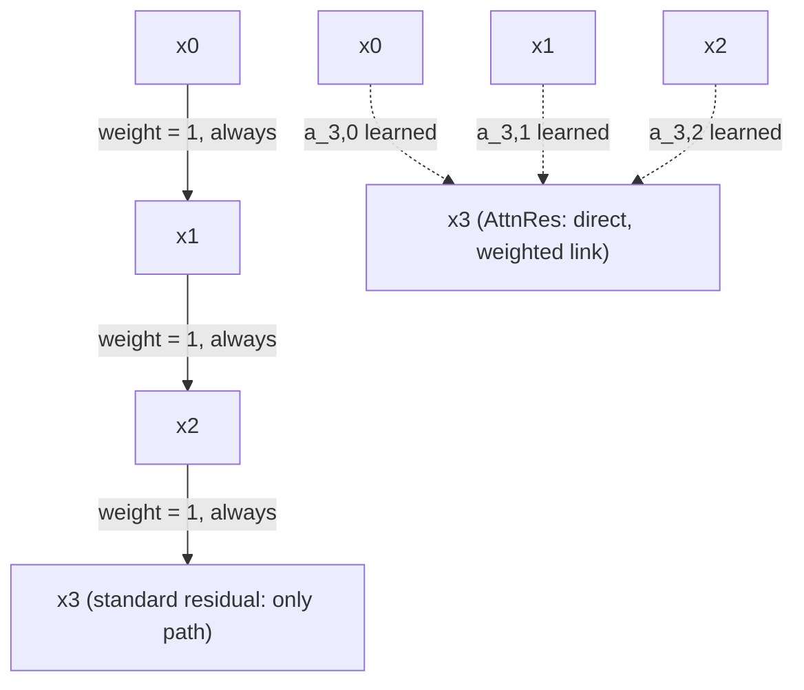

# Attention Residuals (AttnRes)

**Lab:** Kimi Team (Moonshot AI) · **Year:** 2026 · **Paper:** [Attention Residuals](https://arxiv.org/abs/2603.15031)

## The problem

Every architecture in this repo builds on the same residual connection,
`x_l = x_{l-1} + f_l(x_{l-1})` — each layer's output is added, with a fixed
weight of exactly **1**, onto its immediate predecessor. This is also a
*depth*-wise connection only to the layer right before it: layer `l` has no
direct link to layer `l-2`, `l-3`, or any earlier layer — information from
far back can only reach layer `l` by being carried forward, additively and
untunably, through every layer in between. Two consequences follow. First,
the running sum's magnitude grows with depth (more terms keep getting
added in), so any one layer's specific contribution becomes a
proportionally smaller sliver of an ever-growing total — the paper calls
this "uncontrolled hidden-state growth" and "progressive dilution of
individual layer contributions." Second, and more structurally: if one
layer injects something unhelpful, every later layer is stuck carrying it
forward at full, fixed weight — there's no mechanism to *choose* to lean on
an earlier, cleaner layer instead. [`manifold-constrained-hyper-connections`](../manifold-constrained-hyper-connections/)
addresses a related but different problem (multiple parallel residual
streams mixed *width*-wise, within a layer); this is about the single
stream's connections *across depth*.

## The idea

Replace the fixed-weight sum with **softmax attention over every preceding
layer's output**, so layer `l`'s contribution from history is a learned,
content-dependent combination rather than an untunable unit-weight
add-on:

```
standard residual:  x_l = f_l(x_{l-1}) + x_{l-1}                    (weight on prior layer: always 1, only x_{l-1} reachable)

AttnRes:             x_l = f_l(x_{l-1}) + Σ_{j<l} a_{l,j} x_j        where a_l = softmax(score(x_{l-1}, x_0..x_{l-1}))
```

`a_l` is a convex combination (weights are non-negative and sum to 1) over
*every* earlier layer's output for that token, not just the last one —
exactly the same softmax-attention mechanism [`transformer`](../transformer/)
uses across sequence positions within a layer, applied here across *layers*
instead. Because it's a weighted average rather than an unbounded sum, the
aggregated signal doesn't grow with depth the way plain residual
accumulation does, and because the weights are learned per-token, a layer
can put most of its attention on whichever earlier layer's representation
is actually useful — including skipping past a layer whose output turned
out to be unhelpful, something a fixed weight of 1 has no way to express.
For very deep models, computing attention over all `O(L)` prior layers at
every layer is `O(L²)` in depth; the paper's **Block AttnRes** variant
partitions layers into blocks and attends over block-level summaries
instead, trading some of this flexibility for bounded overhead.



## How it's actually used

Introduced and evaluated inside Kimi Linear (48B total / 3B activated
parameters, 1.4T training tokens), where it produced measurably more
uniform output magnitudes and gradient distributions across depth, and
carried forward into Kimi K3. Not yet observed adopted outside Moonshot
AI/Kimi's own model line as of this writing — the evidence for including
it here is the depth of independent technical engagement (multiple
follow-on papers proposing variants, an independent third-party
reimplementation, and independent technical write-ups) rather than
cross-lab production adoption, which is why it's graded NOTABLE rather
than BREAKTHROUGH in this repo's tracking.

## Tradeoffs

The full form is `O(L²)` in the number of layers (every layer attends over
all previous ones), which is why Block AttnRes exists as the practical
deployment variant — a real complexity/flexibility trade against the
full mechanism. It also adds real parameters and compute over a plain
residual add at every layer, for a benefit (better-conditioned depth
scaling, selective use of earlier representations) that's easiest to
measure at the very large depths and token counts where hidden-state
growth and per-layer dilution actually start to bite — the case for it at
smaller scale is weaker.

## References

- [Attention Residuals](https://arxiv.org/abs/2603.15031) (Kimi Team, 2026)
- [Manifold-Constrained Hyper-Connections](../manifold-constrained-hyper-connections/) — this repo's entry on the related but distinct width-wise residual-stream problem
