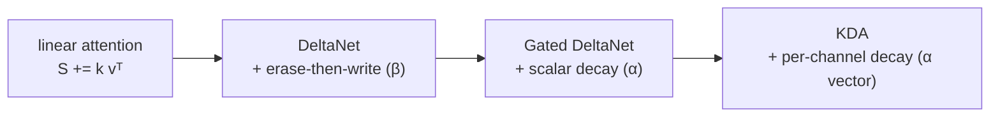

# Gated DeltaNet & KDA (Delta-Rule Linear Attention)

**Lab:** DeltaNet — Songlin Yang et al. (MIT / MIT-IBM Watson AI Lab); Gated DeltaNet — Songlin Yang, Jan Kautz, Ali Hatamizadeh (NVIDIA); KDA — Moonshot AI / Kimi · **Year:** 2024 / 2024 / 2025 · **Paper:** [DeltaNet](https://arxiv.org/abs/2406.06484), [Gated DeltaNet](https://arxiv.org/abs/2412.06464), [KDA](https://arxiv.org/abs/2510.26692)

## The problem

[`linear-attention`](../linear-attention/) replaces softmax attention's O(n²)
similarity with a factored one, which turns the causal form into a
constant-size recurrent state `S` updated by `S_i = S_{i-1} + φ(k_i) v_i^T`
— a pure **write**, never a correction. That has two consequences. First,
if the same key gets reused for a new value later, the old and new
associations just add together in `S`, so a query for that key retrieves a
blend of both instead of the current value — linear attention can store,
but it can't *overwrite*. Second, with no decay, `S` accumulates forever:
old, irrelevant associations occupy the same fixed-capacity state as new,
relevant ones indefinitely, with nothing to make room.

## The idea

**DeltaNet** reframes the state update as an actual error-correcting write,
in the spirit of classical fast-weight / Hebbian-with-erasure memories: before
writing, first partially erase whatever is currently stored under key `k_i`,
proportional to a learned "how much to overwrite" scalar `β_i`, then write
the new value:

```
   S is (d_v x d_k): read out_i = S_i k_i, i.e. S maps a key to a value.

linear attention (pure write):   S_i = S_{i-1} + v_i k_i^T
delta rule (erase, then write):  S_i = S_{i-1}(I - β_i k_i k_i^T) + β_i v_i k_i^T
                                        \_____________________/   \___________/
                                         erase old value at k_i    write new value
```

This is exactly one step of an online least-squares correction — `S_{i-1} k_i`
is what the old state currently predicts for key `k_i`; the update nudges
that prediction toward the true `v_i` by an amount controlled by `β_i`,
rather than just superimposing a new term on top of the old one.

**Gated DeltaNet** adds a *scalar* decay gate `α_i ∈ (0,1)` that shrinks the
whole state before the delta update, giving the memory a controllable
forgetting rate instead of accumulating without bound:

```
S_i = α_i · S_{i-1}(I - β_i k_i k_i^T) + β_i v_i k_i^T
```

**KDA (Kimi Delta Attention)** refines the gate from one scalar per step to
a *per-channel vector* `α_i ∈ R^d` — different dimensions of the state can
be retained or forgotten at different rates, instead of the whole memory
decaying uniformly:

```
S_i = diag(α_i) S_{i-1} (I - β_i k_i k_i^T) + β_i v_i k_i^T   # α_i now a d_v-vector,
                                                                # one decay rate per value-channel
```



## How it's actually used

Gated DeltaNet is already in production: it's the attention mechanism
behind Alibaba's Qwen3.5 / Qwen3-Next, adopted from NVIDIA's original
formulation — a real cross-lab jump, not just a citation. KDA is Moonshot
AI/Kimi's further refinement, the backbone attention mechanism of Kimi
Linear and Kimi K3, and has itself been distilled into at least one other
lab's model (Arcee AI's AFM-4.5B). In both cases the standard deployment
pattern is a **hybrid**: mostly delta-rule/gated-linear layers for
efficiency, interleaved with a minority of full-attention layers (commonly
a 3:1 ratio) to preserve exact, non-decaying retrieval for the tokens that
need it — pure linear/recurrent attention throughout is still avoided in
frontier models.

## Tradeoffs

The delta rule and gating narrow, but don't eliminate, linear attention's
core tradeoff: `S` is still a fixed-size `(d_k × d_v)` state, so total
recall capacity is bounded regardless of how well individual writes are
managed — a long enough sequence with enough distinct associations will
still exceed it. The erase-then-write correction and the gating both add
real compute per step (an extra matrix update rather than a simple sum),
and channel-wise gating (KDA) adds materially more parameters and
complexity than a single scalar gate (Gated DeltaNet) for that finer
control. None of this is free — it's a better point on the same
efficiency/capacity curve [`linear-attention`](../linear-attention/)
already sits on, not an escape from it.

## References

- [Parallelizing Linear Transformers with the Delta Rule over Sequence Length](https://arxiv.org/abs/2406.06484) (Yang et al., 2024) — DeltaNet
- [Gated Delta Networks: Improving Mamba2 with Delta Rule](https://arxiv.org/abs/2412.06464) (Yang, Kautz, Hatamizadeh, 2024) — Gated DeltaNet, ICLR 2025
- [Kimi Linear: An Expressive, Efficient Attention Architecture](https://arxiv.org/abs/2510.26692) (Moonshot AI, 2025) — KDA
- [Gated DeltaNet-2: Decoupling Erase and Write in Linear Attention](https://arxiv.org/abs/2605.22791) (NVIDIA, 2026) — where this lineage goes next, generalizing both Gated DeltaNet and KDA
