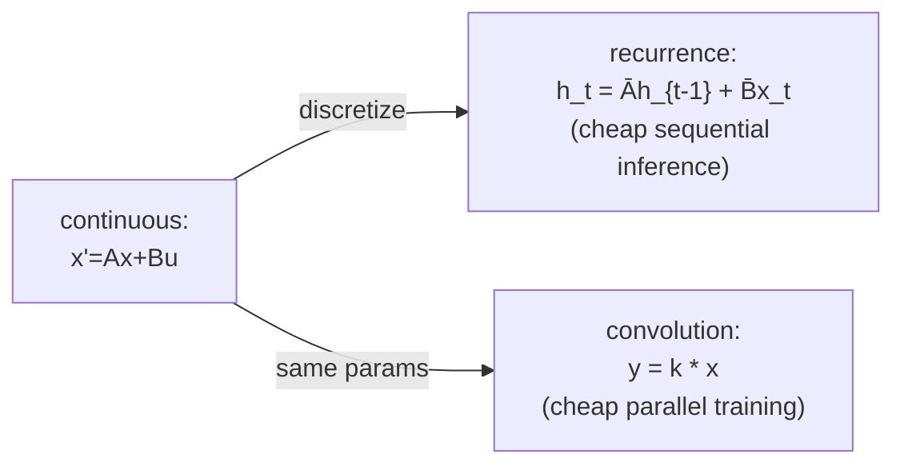

# S4: Structured State Spaces

**Lab:** Stanford (Gu, Goel, Ré) · **Year:** 2021 · **Paper:** [Efficiently Modeling Long Sequences with Structured State Spaces](https://arxiv.org/abs/2111.00396)
**Family:** State-Space

## The problem

By 2021, no architecture cleanly had both properties you want for long
sequences. RNNs give O(1)-per-step, fixed-size-state inference, but train
sequentially (no parallelism across time) and suffer vanishing/exploding
gradients over long spans. [`transformer`](../transformer/) trains fully
in parallel and has no gradient-distance problem, but its attention is
O(n²) in both compute and memory over the sequence, and its "memory" is
an ever-growing KV cache, not a fixed-size summary. S4 is the first
architecture in this lineage to get a real answer to "can one model be
cheap to train in parallel *and* cheap to run sequentially, without
giving up on long-range dependencies."

## The idea

Start from a classical continuous-time linear system:

```
x'(t) = A x(t) + B u(t)      # a hidden state x evolving continuously
y(t)  = C x(t) + D u(t)      # an output read off that state
```

Discretized with a step size Δ, this becomes a **linear recurrence** —
cheap, sequential, fixed-size state, exactly the RNN property:

```
h_t = Ā h_{t-1} + B̄ x_t
y_t = C h_t
```

The same recurrence is *also* exactly equivalent to a single (very long)
**convolution** of the input with a kernel built from Ā, B̄, C — which can
be computed for the whole sequence at once via FFT, in parallel, exactly
the Transformer/CNN property. One set of parameters, two dual algorithms:
sequential for cheap inference, convolutional for parallel training. The
implementation below verifies this equivalence directly — the recurrence
and the convolution must produce numerically identical output, and if
they don't, something's wrong.

The catch is `A`: used naively (e.g. random), the recurrence either
blows up or forgets almost everything within a few steps — a state that
size-16 or size-64 simply can't hold an arbitrarily long, arbitrarily
detailed history. S4's actual contribution is a specific structured
initialization for `A` (derived from HiPPO — High-Order Polynomial
Projection Operators — which shows how to project a growing input history
onto a fixed-size basis that's provably optimal for *reconstructing*
that history) together with a low-rank-plus-normal parameterization that
keeps this structured `A` cheap to diagonalize, so the convolution kernel
stays computable via a Cauchy-kernel trick instead of turning into an
expensive dense-matrix problem. The implementation here uses a simplified
stand-in — a diagonal `A` with several distinct, geometrically-spaced
decay rates — to demonstrate the same qualitative property (a fixed-size
state that retains information at *multiple timescales* at once, instead
of one uniform decay rate) without reproducing HiPPO's exact derivation.



## How it's actually used

S4 itself was rarely deployed as-is in production LLMs — its fixed
(input-independent) dynamics are the thing [`mamba-and-mamba-2`](../mamba-and-mamba-2/)
identifies as the real limitation and fixes. S4's lasting contribution is
structural: it's the paper that proved a state-space model could be
simultaneously fast to train and fast to run, and the recurrence-vs-
convolution duality it established is the same pattern
[`gated-deltanet-and-kda`](../gated-deltanet-and-kda/) and Mamba-2's
structured state-space duality both rediscover from the attention side —
one computation, multiple algorithmic realizations, is the recurring idea
this whole state-space branch of the map is built on.

## Tradeoffs

The dual-form trick only works because the dynamics (`A`, `B`, `C`) are
fixed for the whole sequence, identical regardless of what the input
actually contains — the same limitation plain [`linear-attention`](../linear-attention/)
has for the same underlying reason (a fixed update rule, no per-token
control). That content-independence is precisely what makes both the
parallel-convolution and structured-diagonalization tricks possible, and
precisely what selective SSMs give up to fix.

## References

- [Efficiently Modeling Long Sequences with Structured State Spaces](https://arxiv.org/abs/2111.00396) (Gu, Goel, Ré, 2021)
- [Mamba: Linear-Time Sequence Modeling with Selective State Spaces](../mamba-and-mamba-2/) — this repo's entry on where S4's fixed dynamics get replaced with input-dependent ones
